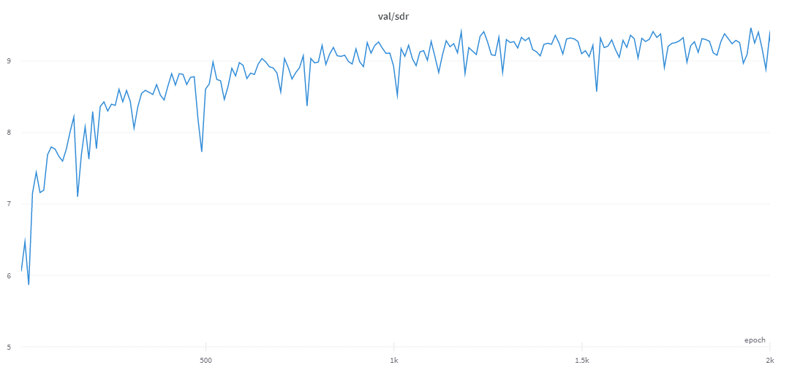
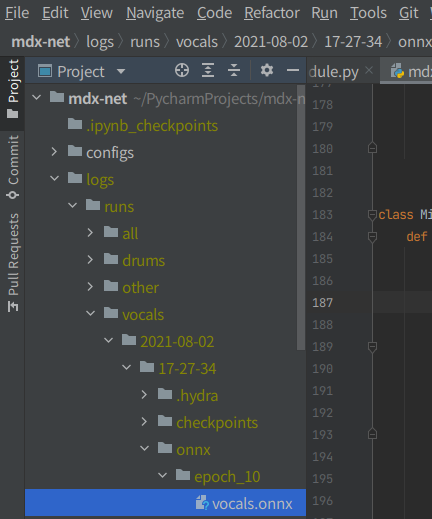

# Submission

## Submission Summary

* Submission ID: 151249
* Submitter: kim_min_seok
* Final rank: 3nd place on leaderboard A
* Final scores on MDXDB21:


  | SDR_song | SDR_bass | SDR_drums | SDR_other | SDR_vocals |
  | :------: | :------: | :-------: | :-------: | :--------: |
  |   7.37   |   7.50   |   7.55    |   5.53    |    8.90    |


## Model Summary

* Data
  * We used 136 tracks from MusDB (train 86 + test 50) and default 14 track validation split.
  * Augmentation
    * Random chunking and mixing sources from different tracks ([1])
    * Pitch shift and time stretch ([2])
* Model
  * Blend[1] of two models: a modified version of TFC-TDF[3] and Demucs[4] 
  * TFC-TDF 
    * Models were trained separately for each source.
    * The input [frequency, time] dimensions are fixed to [2048, 256] for all sources 
      * 256 frames = 6 seconds of audio (sample_rate=44100, hop_length=1024)
      * High frequencies were cut off from the mixture before being input to the networks, and the number of frequency bins to be discarded differs for each source (ex. drums have more high frequencies compared to bass, so cut off more when doing bass separation). In order to fit the frequency dimension of 2048, n_fft differs for each source.
    * We made the following modifications to the original TFC-TDF model:
      * No densely connected convolutional blocks
      * Multiplicative skip connections
      * Increased depth and number of hidden channels
  * Demucs
    * we used the pretrained model with extra data (demucs_extra)
    * overlap=0.5 and no shift trick
  * blending parameters (TFC-TDF : Demucs) => bass 5:5, drums 5:5, other 7:3, vocals 9:1

[1] S. Uhlich et al., "Improving music source separation based on deep neural networks through data augmentation and network blending," 2017 IEEE International Conference on Acoustics, Speech and Signal Processing (ICASSP), 2017.

[2] Cohen-Hadria, Alice, Axel Roebel, and Geoffroy Peeters. "Improving singing voice separation using Deep U-Net and Wave-U-Net with data augmentation." 2019 27th European Signal Processing Conference (EUSIPCO). IEEE, 2019.

[3] Choi, Woosung, et al. "Investigating u-nets with various intermediate blocks for spectrogram-based singing voice separation." 21th International Society for Music Information Retrieval Conference, ISMIR. 2020.

[4] Défossez, Alexandre, et al. "Music source separation in the waveform domain." arXiv preprint arXiv:1911.13254 (2019).


# Reproduction

## How to reproduce the submission

***Note***: The inference time is very close to the time limit, so submission will randomly fail. You might have to submit it several times.

- obtain ```.onnx``` files and ```.pt``` file as described in the [following section](#how-to-reproduce-the-training)
- follow this instruction to deploy parameters
    ```
    git clone https://github.com/kuielab/mdx-net-submission.git
    cd mdx-net-submission
    git checkout leaderboard_B
    git lfs install
    mv ${*.onnx} onnx/
    ```
- or visit the following links that hold the pretrained ```.onnx``` files and ```.pt``` file
  - [Leaderboard B](https://github.com/kuielab/mdx-net-submission/tree/leaderboard_B)

- or visit the submitted repository
  - [Leaderboard B](https://gitlab.aicrowd.com/kim_min_seok/demix/tree/submission106)


## How to reproduce the training

### 1. Data Preparation

Pitch Shift and Time Stretch [2]
- This could have been done on-the-fly along with chunking and mixing ([1]), but we preferred faster train steps over less disk usage. The following scripts are for saving augmented tracks to disk before training. 

- For Leaderboard B
    - run ```python src/utils/data_augmentation.py --data_dir ${your_musdb_path} --train True --valid True --test True``` 

### 2. Phase 1

- Train ```src.models.mdxnet.ConvTDFNet``` for each source.
  - vocals: ```python run.py experiment=multigpu_vocals model=ConvTDFNet_vocals```
  - drums: ```python run.py experiment=multigpu_drums model=ConvTDFNet_drums```
  - bass: ```python run.py experiment=multigpu_bass model=ConvTDFNet_bass```
  - other: ```python run.py experiment=multigpu_other model=ConvTDFNet_other```

- For training, each takes at least 3 days, usually 4~5 days to early-stop for the current configurations. 
  
- Default logging system is [wandb](https://www.wandb.com/)
    
  
- Checkpoint result saving callbacks
  - We use [onnx](https://onnx.ai/) for faster inference to meet the time limit
    - see the [related issue](https://github.com/ws-choi/Conditioned-Source-Separation-LaSAFT/issues/20#issuecomment-840407759)
  - You don't have to manually convert ```.onnx``` files. Our code automatically generates ```.onnx``` whenever a new checkpoint is saved by [checkpoint callback](https://github.com/kuielab/mdx-net/blob/7c6f7daecde13c0e8ed97f308577f6690b0c31af/configs/callbacks/default.yaml#L2)  
    
  - This function was implemented as a callback function
    - see [this](https://github.com/kuielab/mdx-net/blob/7c6f7daecde13c0e8ed97f308577f6690b0c31af/configs/callbacks/default.yaml#L18)
    - and [this](https://github.com/kuielab/mdx-net/blob/7c6f7daecde13c0e8ed97f308577f6690b0c31af/src/callbacks/onnx_callback.py#L11)

#### The epoch of each checkpoint we used  

- Leaderboard B
    - vocals: 1260 epoch
    - bass: 700 epoch
    - drums: 580 epoch
    - other: 740 epoch

> note: the models were submitted before convergence, and the learning rate might have not been optimal as well (ex. for 'other', Leaderboard A score is higher)

# License

[MIT Licence](LICENSE.MD)
